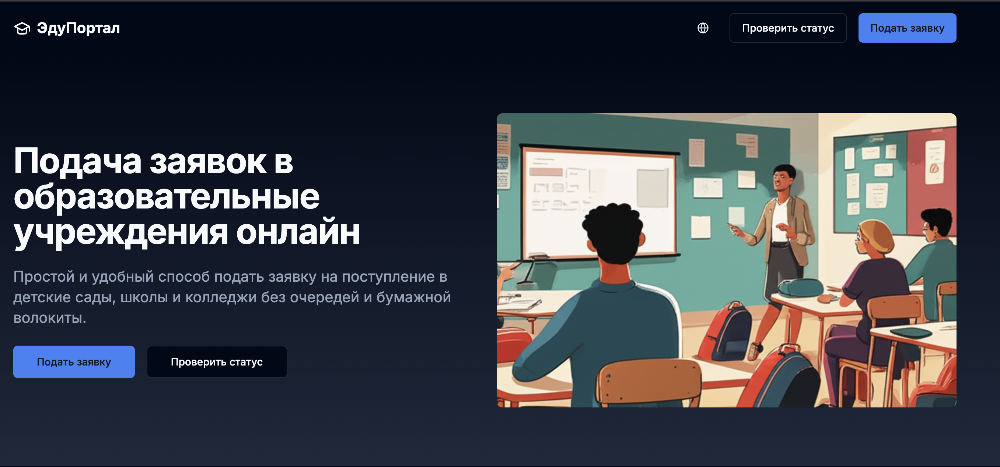

# 🎓 EduApply — Онлайн заявка в садик, школу и колледж

EduApply — это современная онлайн-платформа, позволяющая родителям и учащимся **быстро и удобно подать заявление** в образовательные учреждения: 🏫 детские сады, 📚 школы и 🎓 колледжи.



---

## 🚀 Основные возможности

✅ Поддержка заявок в разные типы учреждений  
✅ Удобная форма подачи с валидацией (Zod)  
✅ Загрузка необходимых документов  
✅ Авторизация с ролями (пользователь / администратор)  
✅ Панель администратора для просмотра и фильтрации заявок  
✅ Email-уведомления о статусе заявок (в будущем)

---

## 🧩 Технологии

- **Next.js (App Router)** — фронтенд и API в одном
- **TypeScript** — строгая типизация
- **MongoDB + Mongoose** — хранение заявок и учреждений
- **Zod** — валидация входных данных
- **NextAuth** — безопасная авторизация
- **Tailwind CSS** — стильный и адаптивный дизайн

---

## 🖼 Интерфейс

| Пользователь           | Админ                                        |
| ---------------------- | -------------------------------------------- |
| ✅ Подать заявку       | 📋 Просмотр всех заявок                      |
| ✅ Загрузить документы | 🔍 Фильтрация по статусу, email и учреждению |
| ✅ Отслеживать статус  | ⚙️ Изменение статуса заявки                  |

---

## ✍️ Как подать заявку

1. Зарегистрируйтесь или войдите
2. Заполните форму (ФИО, дата рождения, email, телефон)
3. Выберите учреждение (садик / школа / колледж)
4. Прикрепите необходимые документы
5. Отправьте заявку!

---

## 📦 Установка проекта

```bash
git clone https://github.com/mirzarakhmanoff/education.git
cd eduapply

# Установка зависимостей
npm install

# Создайте .env.local
cp .env.example .env.local
# Заполните MongoDB URI и NextAuth секрет

# Запуск в dev-режиме
npm run dev
```
